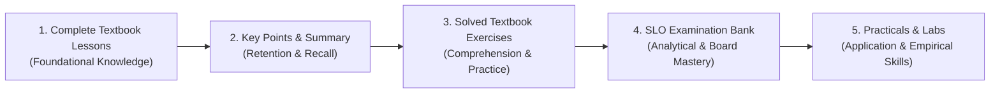

# 04 — UI/UX & Pedagogical Strategy

This document details the core design principles and pedagogical heuristics implemented in SpaceBook.

---

## 1. Core UI/UX Rules

### A. The Single-Line Consolidated Header
- **Problem**: Previous iterations stacked navigation links, breadcrumbs, headings, subheadings, and redundant "Back" buttons across 6 separate vertical rows, pushing valuable study content down the viewport.
- **Rule**: All navigation, breadcrumbs, class headers, subtitles, and board badges must reside in a **single horizontal line** next to the Back icon (`.subjects-single-line-bar`):
  `[← Back to All Classes] | Home › Subjects › Class 9 | 📚 Class 9 — Subjects • Click a subject to explore chapters | 🏛️ KPK Board`

### B. Strictly Maximum Three Statistical Cards in a Row
- **Rule**: Whenever key metrics or overview analytics are rendered, grids must enforce a **strict maximum of 3 cards per row** on desktop screens (`grid-template-columns: repeat(3, 1fr)`):
  - Applied to Class Overview Stats (Core Subjects, Total Units, Solved Bank).
  - Applied to Subject Statistical Cards in the subjects grid.
  - Applied to Chapter Header Analytics (Sections, MCQs, SQs, LQs, SLOs, Practicals).
- **Responsive Wrap**:
  - Desktop (> 992px): Exactly 3 columns.
  - Tablets (680px – 992px): 2 or 3 columns depending on density.
  - Mobile (< 680px): 1 single column for effortless vertical thumb-scrolling.

### C. Collapsed by Default for All Section Cards ("عنوان")
- **Rule**: In dense reading modules (Biology, Mathematics, Pakistan Studies), all section accordions start **collapsed by default**.
- **Benefits**:
  - Students can quickly scan the entire unit structure without being overwhelmed by hundreds of lines of text.
  - Each collapsed card shows the section number badge, title, Urdu name pill, and a brief 2-line teaser snippet.
  - Includes **"➕ Expand All"** and **"➖ Collapse All"** controls for full reading or quick revision.

---

## 2. Pedagogical Architecture: The 5-Tab Suite

Every subject module follows a structured pedagogical progression based on Bloom's Taxonomy:

1. **Tab 1: Complete Verbatim Lessons (`متن`)**:
   - 100% textbook-matched, line-by-line reading.
   - Includes Scientific Info callouts, Society & Technology links, and Quranic foundations.
2. **Tab 2: Key Points & Summary (`اہم نکات`)**:
   - Distills official textbook takeaways for fast exam-day revision.
3. **Tab 3: Solved Textbook Exercises (`حل شدہ مشق`)**:
   - Complete Part A (MCQs with rationale), Part B (Short Questions with model answers), Part C (Detailed Long Questions).
4. **Tab 4: SLO Examination Bank (`ایس ایل او امتحانی بینک`)**:
   - Formatted according to the KPK Directorate of Curriculum & Teacher Education (DCTE) assessment format.
   - Segregated by cognitive levels: **Knowledge**, **Understanding**, and **Application**.
5. **Tab 5: Practical & Laboratory Skills (`عملی تجربات`)**:
   - Standard board experiment templates: Apparatus, Principles, Procedure, Observations, Inferences, Precautions.

---

## 3. Bilingual & Interactive Accessibility

- **Instant Word-Click Popover**: English-medium students who encounter complex scientific or literary words can simply click any word to see its Urdu and Pashto meanings instantly.
- **Nastaleeq Typography**: Urdu and Pakistan Studies sections use native Nastaleeq fonts (`Jameel Noori Nastaleeq`, `Urdu Typesetting`) with proper RTL text rendering and generous line-heights (1.8 – 2.0).
- **Dual-Voice Audio Narration**: Urdu lessons feature synchronized speech synthesis with real-time word highlighting, aiding students with reading difficulties or dialect differences.
